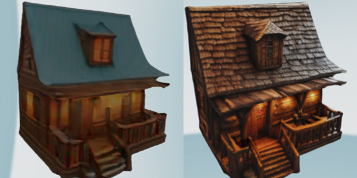

triposr-texture-gen
===================



A script to generate a texture for a 3D mesh using [Stable
Diffusion](https://stability.ai/stable-image) and
[ControlNet](https://github.com/lllyasviel/ControlNet). It's designed for the outputs of
[TripoSR](https://github.com/VAST-AI-Research/TripoSR), an image-to-3D model by [Stability
AI](https://stability.ai/) and [Tripo AI](https://www.tripo3d.ai/), but might work on other meshes
as well. TripoSR outputs more coarse-grained textures in the form of vertex colors, so this is
helpful for (re)applying fine detail to the models.

Currently, it only paints the front half of the model, but more enhancements are planned.

Installation
------------

Create a virtualenv and install requirements:

```sh
python3 -m virtualenv venv
venv/bin/pip install -r requirements.txt
```

Usage
-----

Run the `text2texture.py` script with the output mesh from
[TripoSR](https://github.com/VAST-AI-Research/TripoSR) along with a textual description of the
desired appearance. 

```sh
venv/bin/python text2texture.py ~/TripoSR/output/0/mesh.obj 'a chair that looks like an avocado'
```

The first time this runs, it will download a text-to-image model (by default,
[Lykon/dreamshaper-8](https://huggingface.co/Lykon/dreamshaper-8)) and a ControlNet model. The image
model can be configured, say, to a model you've already fetched from Hugging Face.

Currently this only paints the "front" of the model, which is guessed based on the orientation of
the mesh and should roughly correspond to the original input image.


--------

Copyright © 2024 Evan Jones
